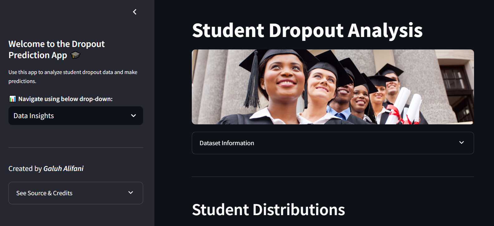
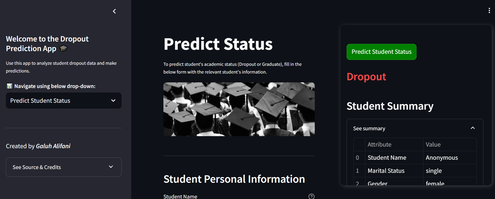

# [Predicting Student Dropout](https://huggingface.co/spaces/galuhalifani/student_dropout_prediction)

## Repository Outline
```
Main files:
1. README.md - Desciption and context of project
2. P1M2_galuh_alifani.ipynb - Notebook that contains data analysis and predictive model training
3. P1M2_galuh_alifani_inf.ipynb - Notebook that contains data inference exercise using our predictive model from notebook #2 above
4. url.txt - URL of the deployed web app

Other files:
- best_model.pkl - Best model file of our predictive modeling exercise
- reverse_mapping.txt - Mapping of target variable for inference interpretation
- enrolled_students_for_inf.csv - CSV file that contains students with enrolled status, to be used in our inference notebook
- student_data_analysis.csv - CSV file that contains student data for web app analytics purpose (preprocessed, un-encoded, and cleaned)
- student_enrollment_data_raw - CSV file that contains raw student data from the source site (encoded, un-cleaned, un-processed)
- deployment folder - files for web app deployment
```

## Problem Background
Academic success plays a crucial role in shaping an individual’s future, influencing career opportunities, financial stability, and overall well-being. However, many students face challenges that may lead to poor academic performance or even dropping out. Early identification of students at risk of academic failure or dropout is essential to provide timely interventions and support. Hence, this project aims to develop a predictive model that determines whether a student is likely to drop out based on certain contributing factors.

## Project Output
The output of this project is a predictive model and a corresponding web-app (MVP) to identify whether a student is likely to drop-out, so that the the school can offer early intervention strategies to these students, such as study resources, mentorship programs, or psychological support.

The [Web App](https://huggingface.co/spaces/galuhalifani/student_dropout_prediction) consist of two main pages:
- Data Insights: Contains exploratory data analysis of the student dataset used to train our model
- Predict Student Status: Contains fields to input information regarding a target student and predict whether he/she is likely to drop out.

Future improvement of the app is ongoing, including feature to upload multiple students' data to the app and predict multiple students' dropout risk at the same time.

## Data
The dataset is fetched through UCI Machine Learning Repository: [Students' Enrollment Status](https://archive.ics.uci.edu/dataset/697/predict+students+dropout+and+academic+success). 

This dataset contains 4,000 records of students from higher education institutions in Portugal, enrolled in different undergraduate degrees, and includes information known at the time of student's enrollment: education background, family & financial background, macroeconomic conditions; and students' academic performance.

## Method
The method used in this project is supervised machine learning with 2-class classification problem. We are using several known distance-based, tree-based, bagging, and boosting models such as KNN, SVM, Decision Tree, Random Forest, and CatBoost classifiers.

## Stacks
Tech stacks include:
- python
- pandas & numpy
- streamlit for web-app UI
- scipy
- scikit-learn
- matplotlib & seaborn for visualization. 

The deployed web-app is utilizing HuggingFace as deployment platform

## Reference
- [Deployed Web App](https://huggingface.co/spaces/galuhalifani/student_dropout_prediction)
- [Data Source](https://archive.ics.uci.edu/dataset/697/predict+students+dropout+and+academic+success)

## Contact
Galuh Adika Alifani
galuh.adika@gmail.com

## Others
### Web App Snapshots



---